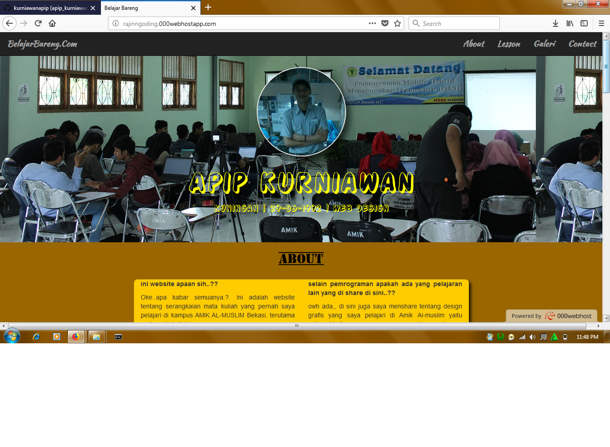

# belajarBareng
web pembelajaran tentang dekstop programming di Amik Al-Muslim.
berhubungan dengan waktu yang padat antara kerja kuliah istirahat, kadang mahasiswa/i amik itu kesulitan untuk memahami mata kuliah di kampus
terutama pada pemrograman.
untuk itu saya membuat web ini agar teman2 tidak lupa akan materi2 yang sudah di berikan dosen terutama pada pemrograman.
dan bisa memahaminya lagi di rumah. 
web ini berisi tentang materi-materi tentang dekstop programming mulai dari pascal,c++,vb dan lainnya...

